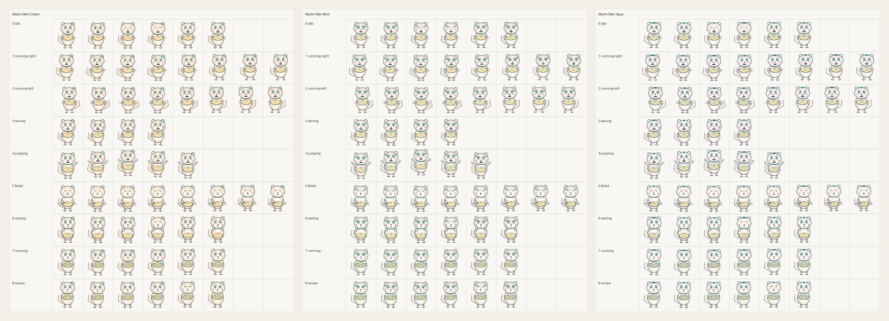
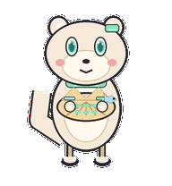
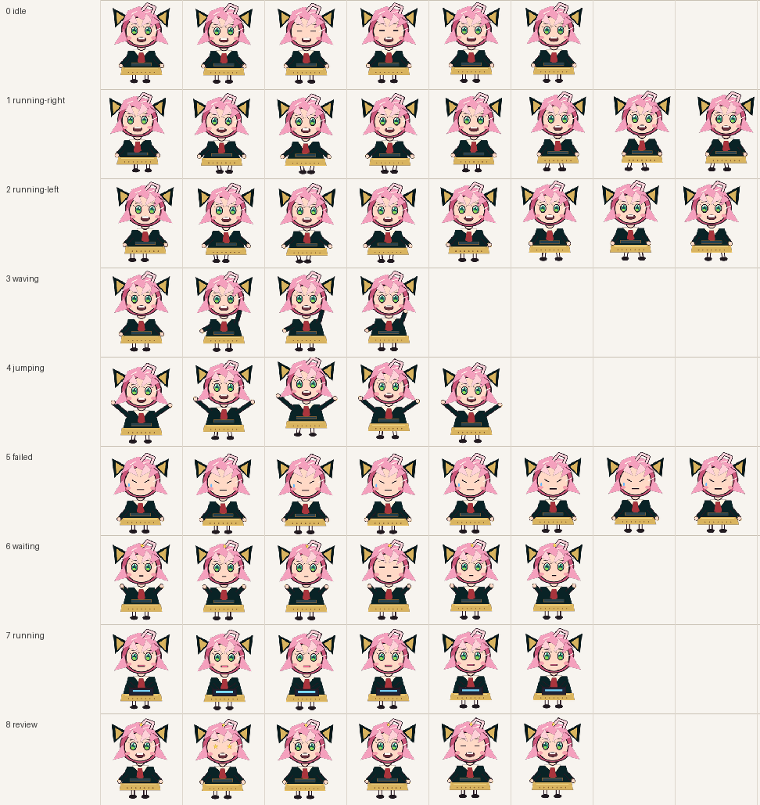

# Codex Pet Gallery

Playable little companions for the Codex app.

This repository collects installable Codex custom pets, preview sheets, and
small animation samples. The pets here are original community-style creations
made for the Codex pet system.

Want to create your own? Use the companion skill:
[Rito-w/codex-pet-factory](https://github.com/Rito-w/codex-pet-factory).

## Gallery

### Mochi Otter

Soft chibi otters with cream, mint, and aqua cyber accents. They love drifting
through the workday, but somehow become extremely competent when bugs appear.



| Idle | Working | Failed | Review |
| --- | --- | --- | --- |
|  |  |  |  |

Included variants:

- `mochi-otter-cream`
- `mochi-otter-mint`
- `mochi-otter-aqua`

### Stella

An original pink-haired coding companion with a black-and-gold outfit and
expressive Codex task states.



| Jumping | Review |
| --- | --- |
|  |  |

Included package:

- `stella-codex-pet`

## Install

Clone this repo:

```sh
git clone https://github.com/Rito-w/codex-pet-gallery.git
cd codex-pet-gallery
```

Install all pets:

```sh
mkdir -p ~/.codex/pets
cp -R pets/* ~/.codex/pets/
```

Or install one pet:

```sh
mkdir -p ~/.codex/pets
cp -R pets/mochi-otter-cream ~/.codex/pets/
```

Then open Codex:

```text
Settings -> Appearance -> Pets -> refresh custom pets
```

Select the pet you want, then use `/pet` to wake or tuck away the pet overlay.

## Repository Layout

```text
pets/
  <pet-id>/
    pet.json
    spritesheet.webp
showcase/
  preview images and GIFs
packages/
  optional zip bundles
docs/
  contribution templates
```

## Make Your Own Pet

Install the factory skill:

```sh
mkdir -p ~/.codex/skills
git clone https://github.com/Rito-w/codex-pet-factory.git \
  ~/.codex/skills/codex-pet-factory
```

Then ask Codex something like:

```text
Use $codex-pet-factory to generate a Codex pet:
animal: tiny otter
style: soft anime chibi, light cyber UI
palette: cream white, mint green, pale blue
personality: lazy but fixes bugs when it matters
prop: shell keyboard and fish cursor
name: Mochi Otter
count: 3 variants
```

## Contribute

PRs are very welcome.

You can contribute:

- new original pets
- better preview GIFs or contact sheets
- repaired spritesheets
- prompt recipes
- theme packs
- install docs for different platforms

Before opening a PR, check [CONTRIBUTING.md](CONTRIBUTING.md). Keep pets
original, readable at `192x208`, and compatible with the Codex custom pet
contract.

Make something charming, weird, useful, or delightfully distracting. Tiny
desktop friends are better when more people get to invent them.

